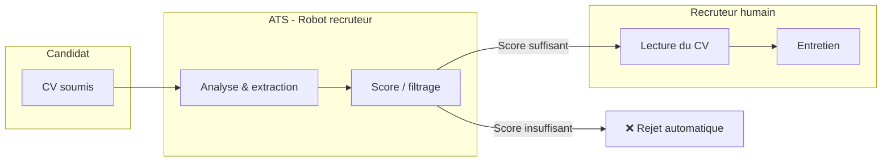

<div align="center">


# ChapChapCV

**Générateur de CV ATS-friendly — prévisualisation en temps réel & export PDF**

[](https://react.dev/)
[](https://www.typescriptlang.org/)
[](https://vitejs.dev/)
[](https://tailwindcss.com/)
[](#-licence)

*Créé par [Prince Kouamé](https://www.princekouame.com) — pour les talents en Côte d'Ivoire et partout ailleurs.*

[🚀 Démarrage rapide](#-démarrage-rapide) ·
[✨ Fonctionnalités](#-fonctionnalités) ·
[📐 Architecture](#-architecture) ·
[📄 Export PDF](#-export-pdf) ·
[🤖 Import IA](#-import-ia-optionnel) ·
[👤 Auteur](#-auteur--contact)

</div>

---

## 📖 À propos

**ChapChapCV** est un éditeur de curriculum vitae pensé pour passer les filtres des **ATS** (*Applicant Tracking Systems*). Ces logiciels trient automatiquement les candidatures : un CV trop graphique, mal structuré ou illisible par machine a peu de chances d’atteindre un recruteur humain.

ChapChapCV propose :

- un **format sobre et lisible** par les robots de recrutement ;
- une **prévisualisation A4** en direct pendant la saisie ;
- un **export PDF** en un clic ;
- un **import assisté par IA** (Google Gemini) pour remplir le CV à partir d’un texte ou d’un document existant.

> **Libre d’usage** — utilisez, partagez et adaptez cet outil librement, y compris à des fins personnelles ou professionnelles. Voir la section [Licence](#-licence).

---

## ✨ Fonctionnalités

| Fonctionnalité | Description |
|----------------|-------------|
| **Éditeur complet** | Informations personnelles, résumé, expériences, compétences, projets, certifications, formation, langues, centres d’intérêt, recommandations |
| **Mise en page ATS** | Structure linéaire, typographie classique, sans colonnes complexes ni graphismes superflus |
| **3 layouts d’en-tête** | Photo + coordonnées : centré, photo à gauche, ou photo à droite |
| **Personnalisation** | Photo (cercle ou coins arrondis), police (serif, sans-serif, mono) |
| **Prévisualisation live** | Rendu A4 (`210mm × 297mm`) synchronisé avec l’éditeur |
| **Sauvegarde locale** | Données persistées dans le `localStorage` du navigateur |
| **Export PDF** | Génération via `html2canvas` + `jsPDF` |
| **Import IA** | Extraction structurée depuis texte, PDF, DOCX, TXT, MD (clé API Gemini requise) |
| **Données d’exemple** | CV type prérempli pour découvrir l’outil rapidement |
| **Desktop only** | Interface optimisée pour écran large (≥ 1024px) |

---

## 🧠 Pourquoi un CV « ATS-friendly » ?



| Format classique (Canva, colonnes, icônes lourdes…) | Format ChapChapCV |
|-----------------------------------------------------|-------------------|
| Risque d’extraction incorrecte des compétences | Texte structuré et hiérarchisé |
| Éléments graphiques non interprétés | Mise en page minimaliste |
| Colonnes multiples | Flux vertical lisible |

---

## 📐 Architecture


### Structure du projet

```
chapchapcv/
├── public/
│   ├── banner-github.jpg    # Bannière README
│   ├── logo-noir.png
│   ├── logo-blanc.png
│   ├── favicon.png
│   └── open-graph.png
├── src/
│   ├── App.tsx              # Shell, export PDF, état global
│   ├── components/
│   │   ├── CVEditor.tsx     # Formulaire d’édition
│   │   ├── CVPreview.tsx    # Rendu A4 du CV
│   │   ├── AIImportModal.tsx
│   │   ├── AboutModal.tsx
│   │   └── MobileBlocker.tsx
│   ├── types.ts             # Schéma CVData
│   ├── initialData.ts       # Données d’exemple
│   └── index.css            # Styles globaux & print
├── .env.example
├── package.json
└── vite.config.ts
```

---

## 🚀 Démarrage rapide

### Prérequis

- **Node.js** 18+ (recommandé : 20 LTS)
- **npm** 9+

### Installation

```bash
# Cloner le dépôt
git clone https://github.com/VOTRE_UTILISATEUR/chapchapcv.git
cd chapchapcv

# Installer les dépendances
npm install
```

### Lancer en développement

```bash
npm run dev
```

L’application est disponible sur **http://localhost:3000** (port configurable dans `package.json`).

### Build de production

```bash
npm run build    # Compile dans dist/
npm run preview  # Prévisualise le build
```

### Vérification TypeScript

```bash
npm run lint
```

---

## 🔐 Variables d’environnement

Copiez le fichier d’exemple et configurez votre clé API :

```bash
cp .env.example .env.local
```

| Variable | Obligatoire | Description |
|----------|-------------|-------------|
| `GEMINI_API_KEY` | Non* | Clé API [Google AI Studio](https://aistudio.google.com/apikey) pour l’import IA |
| `APP_URL` | Non | URL de l’application (déploiement) |

\* Sans clé Gemini, l’éditeur et l’export PDF fonctionnent normalement ; seul l’**Import IA** sera indisponible.

**Exemple `.env.local` :**

```env
GEMINI_API_KEY="votre_cle_api_ici"
```

> ⚠️ Ne commitez **jamais** votre fichier `.env.local` ni vos clés API.

---

## 📄 Export PDF

1. Remplissez ou importez votre CV dans l’éditeur.
2. Vérifiez le rendu dans la prévisualisation à droite.
3. Cliquez sur **Exporter PDF**.

Le PDF est généré à partir du DOM de prévisualisation (`#cv-preview`) via **html2canvas** puis **jsPDF**. En cas d’échec, utilisez **Ctrl+P** → « Enregistrer en PDF » (styles d’impression inclus dans `index.css`).

---

## 🤖 Import IA (optionnel)

L’import IA permet de structurer automatiquement un CV existant :

- **Coller du texte** brut
- **Importer un fichier** : `.txt`, `.md`, `.pdf`, `.docx`

Le modèle **Gemini** extrait les champs (expériences, compétences, formation, etc.) et les injecte dans l’éditeur. Les contenus non francophones peuvent être traduits en français.

---

## 🛠️ Stack technique

| Couche | Technologie |
|--------|-------------|
| UI | React 19, TypeScript |
| Build | Vite 6 |
| Styles | Tailwind CSS 4 |
| Animations | Motion |
| Icônes (UI) | Lucide React |
| Export PDF | html2canvas, jsPDF |
| IA | `@google/genai` (Gemini) |
| Utilitaires | clsx, tailwind-merge |

---

## 📜 Licence

Ce projet est **libre d’usage**.

Vous êtes autorisé à :

- ✅ utiliser l’application gratuitement ;
- ✅ modifier le code source ;
- ✅ redistribuer des versions adaptées ;
- ✅ l’utiliser dans un cadre personnel, éducatif ou professionnel.

**Conditions :**

- Conserver la mention de l’auteur original lors d’une redistribution substantielle du code ;
- Ne pas présenter le projet comme un service officiel de tiers sans accord ;
- L’outil est fourni **« en l’état »**, sans garantie.

Pour toute question juridique ou usage commercial à grande échelle, contactez l’auteur (voir ci-dessous).

---

## 👤 Auteur & contact

<table>
  <tr>
    <td><strong>Nom</strong></td>
    <td>Prince Kouamé</td>
  </tr>
  <tr>
    <td><strong>Rôle</strong></td>
    <td>Software Developer</td>
  </tr>
  <tr>
    <td><strong>Site web</strong></td>
    <td><a href="https://www.princekouame.com">www.princekouame.com</a></td>
  </tr>
</table>

### ☕ Soutenir le projet

Si cet outil vous a été utile, vous pouvez contribuer librement à sa maintenance :

**[Contribution via Wave](https://pay.wave.com/m/M_ci_BzrF5N5Dmt4d/c/ci/)**

Merci pour votre soutien !

---

## 🤝 Contribuer

Les contributions sont les bienvenues :

1. **Forkez** le dépôt
2. **Créez** une branche (`git checkout -b feature/ma-fonctionnalite`)
3. **Commitez** vos changements (`git commit -m "feat: description claire"`)
4. **Poussez** la branche (`git push origin feature/ma-fonctionnalite`)
5. **Ouvrez** une Pull Request

### Idées de contributions

- Amélioration de l’export PDF (qualité, accessibilité)
- Nouveaux templates ATS
- Internationalisation (EN, etc.)
- Tests automatisés
- Corrections de bugs et documentation

---

## ❓ FAQ

<details>
<summary><strong>L’application fonctionne-t-elle sur mobile ?</strong></summary>

Non. ChapChapCV est conçu pour le **desktop** (largeur ≥ 1024px) afin de garantir une expérience d’édition confortable sur deux panneaux (éditeur + prévisualisation).
</details>

<details>
<summary><strong>Mes données sont-elles envoyées sur un serveur ?</strong></summary>

Non, par défaut. Le CV est stocké **localement** dans votre navigateur (`localStorage`). Seul l’**Import IA** envoie le contenu que vous choisissez à l’API Google Gemini.
</details>

<details>
<summary><strong>Puis-je utiliser ChapChapCV sans clé API ?</strong></summary>

Oui. L’édition manuelle, la prévisualisation et l’export PDF ne nécessitent pas de clé API.
</details>

<details>
<summary><strong>Mon CV sera-t-il accepté par tous les ATS ?</strong></summary>

Aucun outil ne peut garantir un passage à 100 %. ChapChapCV maximise les bonnes pratiques (structure, lisibilité machine), mais le résultat dépend aussi du contenu, des mots-clés et du ATS cible.
</details>

---

<div align="center">

**Fait avec passion pour vous.**


</div>
