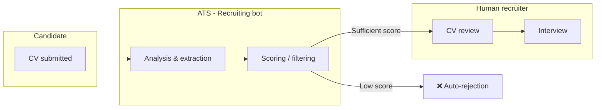
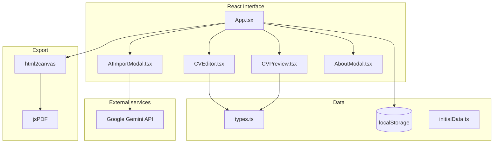

<div align="center">


# Fiiltr

**ATS-friendly CV Builder — real-time preview & PDF export**

[](https://react.dev/)
[](https://www.typescriptlang.org/)
[](https://vitejs.dev/)
[](https://tailwindcss.com/)
[](#-license)

*Created by [Prince Kouamé](https://www.princekouame.com) — for talents in Côte d'Ivoire and everywhere else.*

[🚀 Quick start](#-quick-start) ·
[✨ Features](#-features) ·
[📐 Architecture](#-architecture) ·
[📄 PDF Export](#-pdf-export) ·
[🤖 AI Import](#-ai-import-optional) ·
[👤 Author](#-author--contact)

</div>

---

## 📖 About

**Fiiltr** is a curriculum vitae editor designed to pass **ATS** (*Applicant Tracking Systems*) filters. These systems automatically sort applications: a CV that is too graphical, poorly structured, or unreadable by machines has little chance of reaching a human recruiter.

Fiiltr provides:

- a **clean, machine-readable format** that recruitment bots can parse ;
- a **live A4 preview** while you type ;
- a **one-click PDF export** ;
- an **AI-assisted import** (Google Gemini) to fill your CV from existing text or documents.

> **Free to use** — freely use, share, and adapt this tool, including for personal or professional purposes. See the [License](#-license) section.

---

## ✨ Features

| Feature | Description |
|---------|-------------|
| **Full editor** | Personal info, summary, experience, skills, projects, certifications, education, languages, interests, references |
| **ATS layout** | Linear structure, classic typography, no complex columns or unnecessary graphics |
| **3 header layouts** | Photo + contact info: centered, photo left, or photo right |
| **Customization** | Photo (circle or rounded corners), font (serif, sans-serif, mono) |
| **Live preview** | A4 render (`210mm × 297mm`) synced with the editor |
| **Local save** | Data persisted in the browser's `localStorage` |
| **PDF export** | Generation via `html2canvas` + `jsPDF` |
| **AI import** | Structured extraction from text, PDF, DOCX, TXT, MD (Gemini API key required) |
| **Sample data** | Pre-filled example CV to quickly discover the tool |
| **Desktop only** | Interface optimized for large screens (≥ 1024px) |

---

## 🧠 Why an "ATS-friendly" CV?



| Classic format (Canva, columns, heavy icons…) | Fiiltr format |
|------------------------------------------------|-------------------|
| Risk of incorrect skill extraction | Structured, hierarchical text |
| Graphical elements not interpreted | Minimalist layout |
| Multiple columns | Readable vertical flow |

---

## 📐 Architecture



### Project structure

```
Fiiltr/
├── public/
│   ├── banner-github.jpg    # README banner
│   ├── logo-noir.png
│   ├── logo-blanc.png
│   ├── favicon.png
│   └── open-graph.png
├── src/
│   ├── App.tsx              # Shell, PDF export, global state
│   ├── components/
│   │   ├── CVEditor.tsx     # Edit form
│   │   ├── CVPreview.tsx    # A4 CV render
│   │   ├── AIImportModal.tsx
│   │   ├── AboutModal.tsx
│   │   └── MobileBlocker.tsx
│   ├── types.ts             # CVData schema
│   ├── initialData.ts       # Sample data
│   └── index.css            # Global & print styles
├── .env.example
├── package.json
└── vite.config.ts
```

---

## 🚀 Quick start

### Prerequisites

- **Node.js** 18+ (recommended: 20 LTS)
- **npm** 9+

### Installation

```bash
# Clone the repo
git clone https://github.com/YOUR_USERNAME/Fiiltr.git
cd Fiiltr

# Install dependencies
npm install
```

### Run in development

```bash
npm run dev
```

The app is available at **http://localhost:3000** (port configurable in `package.json`).

### Production build

```bash
npm run build    # Compiles to dist/
npm run preview  # Preview the build
```

### TypeScript check

```bash
npm run lint
```

---

## 🔐 Environment variables

Copy the sample file and configure your API key:

```bash
cp .env.example .env.local
```

| Variable | Required | Description |
|----------|----------|-------------|
| `GEMINI_API_KEY` | No* | [Google AI Studio](https://aistudio.google.com/apikey) API key for AI import |
| `APP_URL` | No | Application URL (deployment) |

\* Without a Gemini key, the editor and PDF export work normally; only the **AI Import** will be unavailable.

**Example `.env.local`:**

```env
GEMINI_API_KEY="your_api_key_here"
```

> ⚠️ **Never** commit your `.env.local` file or API keys.

---

## 📄 PDF Export

1. Fill in or import your CV in the editor.
2. Check the render in the preview panel on the right.
3. Click **Export PDF**.

The PDF is generated from the preview DOM (`#cv-preview`) via **html2canvas** then **jsPDF**. If it fails, use **Ctrl+P** → "Save as PDF" (print styles included in `index.css`).

---

## 🤖 AI Import (optional)

The AI import allows you to automatically structure an existing CV:

- **Paste raw text**
- **Import a file**: `.txt`, `.md`, `.pdf`, `.docx`

The **Gemini** model extracts fields (experience, skills, education, etc.) and injects them into the editor. Non-French content can be translated to French.

---

## 🛠️ Tech stack

| Layer | Technology |
|-------|------------|
| UI | React 19, TypeScript |
| Build | Vite 6 |
| Styles | Tailwind CSS 4 |
| Animations | Motion |
| Icons (UI) | Lucide React |
| PDF Export | html2canvas, jsPDF |
| AI | `@google/genai` (Gemini) |
| Utilities | clsx, tailwind-merge |

---

## 📜 License

This project is **free to use**.

You are permitted to:

- ✅ use the application for free ;
- ✅ modify the source code ;
- ✅ redistribute adapted versions ;
- ✅ use it for personal, educational, or professional purposes.

**Conditions:**

- Retain the original author credit when substantially redistributing the code ;
- Do not present the project as an official third-party service without agreement ;
- The tool is provided **"as is"**, without warranty.

For any legal questions or large-scale commercial use, contact the author (see below).

---

## 👤 Author & contact

<table>
  <tr>
    <td><strong>Name</strong></td>
    <td>Prince Kouamé</td>
  </tr>
  <tr>
    <td><strong>Role</strong></td>
    <td>Software Developer</td>
  </tr>
  <tr>
    <td><strong>Website</strong></td>
    <td><a href="https://www.princekouame.com">www.princekouame.com</a></td>
  </tr>
</table>

### ☕ Support the project

If this tool has been useful to you, feel free to contribute to its maintenance:

**[Contribute via Wave](https://pay.wave.com/m/M_ci_BzrF5N5Dmt4d/c/ci/)**

Thank you for your support!

---

## 🤝 Contributing

Contributions are welcome:

1. **Fork** the repo
2. **Create** a branch (`git checkout -b feature/my-feature`)
3. **Commit** your changes (`git commit -m "feat: clear description"`)
4. **Push** the branch (`git push origin feature/my-feature`)
5. **Open** a Pull Request

### Contribution ideas

- Improve PDF export (quality, accessibility)
- New ATS templates
- Internationalization
- Automated tests
- Bug fixes and documentation

---

## ❓ FAQ

<details>
<summary><strong>Does the app work on mobile?</strong></summary>

No. Fiiltr is designed for **desktop** (width ≥ 1024px) to ensure a comfortable two-panel editing experience (editor + preview).
</details>

<details>
<summary><strong>Are my data sent to a server?</strong></summary>

No, by default. Your CV is stored **locally** in your browser (`localStorage`). Only the **AI Import** sends the content you choose to the Google Gemini API.
</details>

<details>
<summary><strong>Can I use Fiiltr without an API key?</strong></summary>

Yes. Manual editing, preview, and PDF export do not require an API key.
</details>

<details>
<summary><strong>Will my CV be accepted by all ATS?</strong></summary>

No tool can guarantee a 100% pass rate. Fiiltr maximizes best practices (structure, machine readability), but the result also depends on the content, keywords, and the target ATS.
</details>

---

---

<div align="center">

**Made with passion for you.**


</div>
